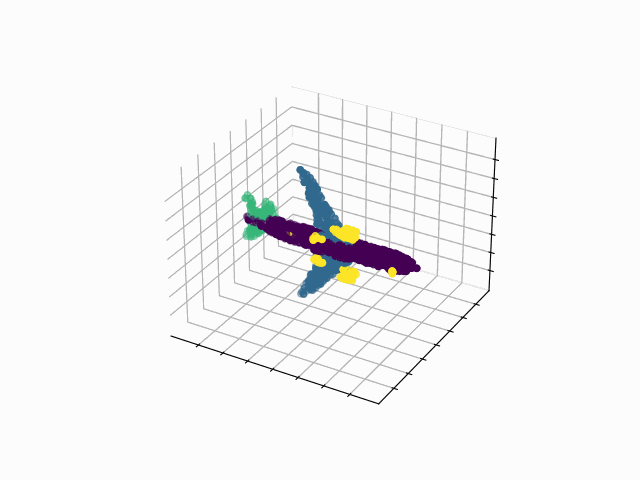
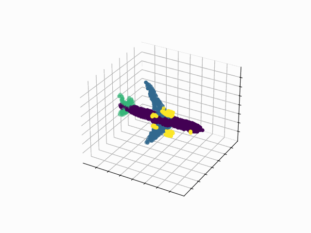
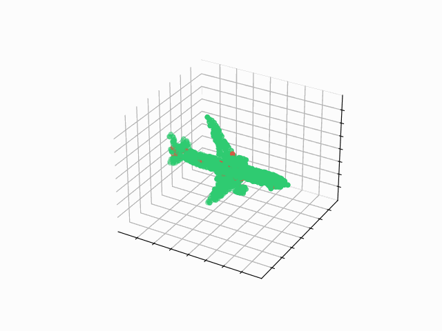
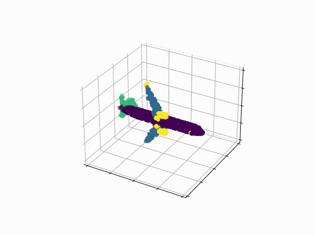
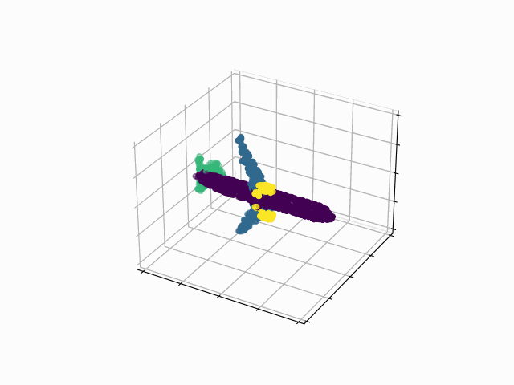
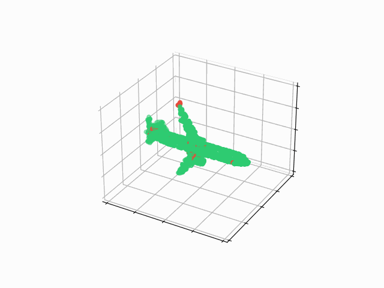
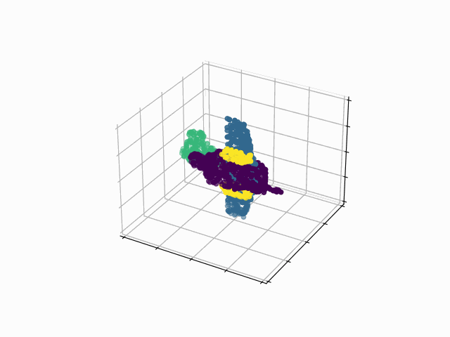
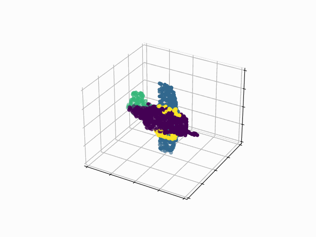
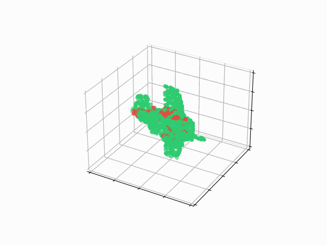
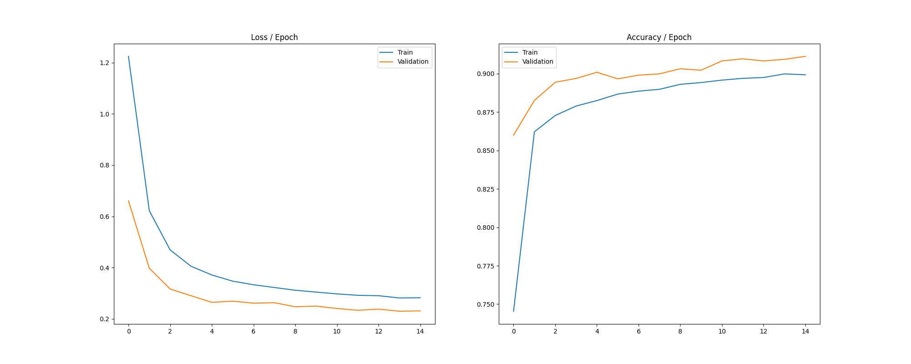

# RandLA-Net - PyTorch Implementation

## Results
### Examples from Test Set
<table>
    <thead>
        <tr>
            <th style="text-align: center;">Ground Truth</th>
            <th style="text-align: center;">Predicted</th>
            <th style="text-align: center;">Diff.</th>
        </tr>
    </thead>
    <tr>
        <td></td>
        <td></td>
        <td></td>
    </tr>
    <tr>
        <td></td>
        <td></td>
        <td></td>
    </tr>
    <tr>
        <td></td>
        <td></td>
        <td></td>
    </tr>
</table>

### Training Process

### Accuracy
<table style="text-align: center;">
    <thead>
        <tr>
            <th>Train Set</th>
            <th>Validation Set</th>
            <th>Test Set</th>
        </tr>
    </thead>
    <tr>
        <td>91%</td>
        <td>90%</td>
        <td>90%</td>
    </tr>
</table>

## Usage
- Download the dataset: `make download`
- Train + Test + Visualization: `make run`

## Resources

- [Hu, Q., Yang, B., Xie, L., Rosa, S., Guo, Y., Wang, Z., ... & Markham, A. (2020). Randla-net: Efficient semantic segmentation of large-scale point clouds. In Proceedings of the IEEE/CVF Conference on Computer Vision and Pattern Recognition (pp. 11108-11117).](https://arxiv.org/abs/1911.11236)
- [RandLA-Net: Efficient Semantic Segmentation of Large-Scale Point Clouds](https://github.com/aRI0U/RandLA-Net-pytorch)